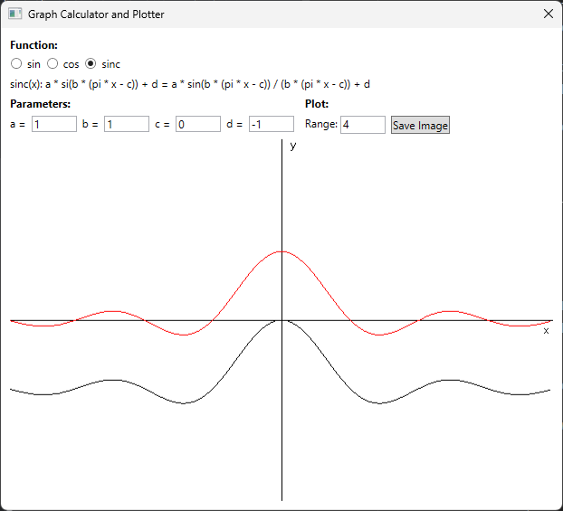
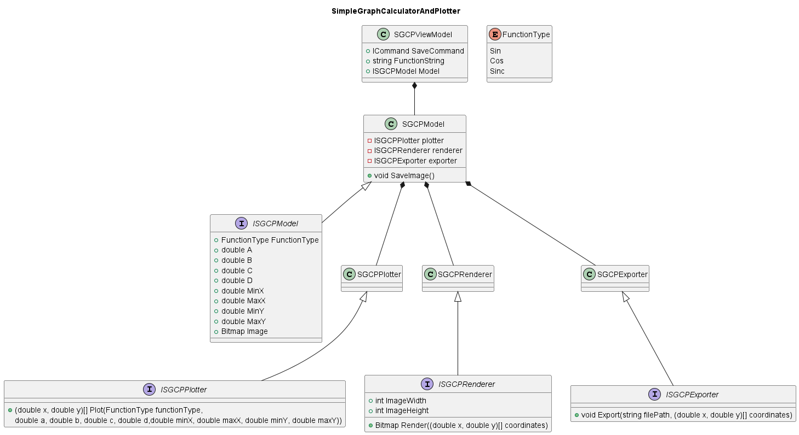
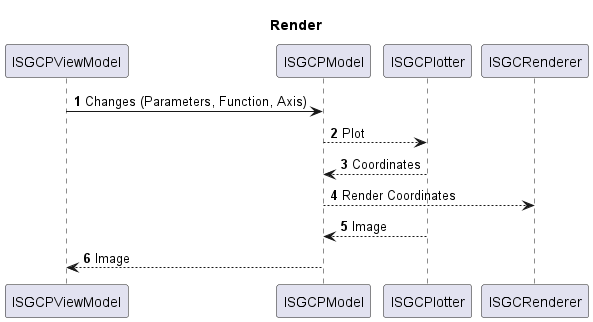
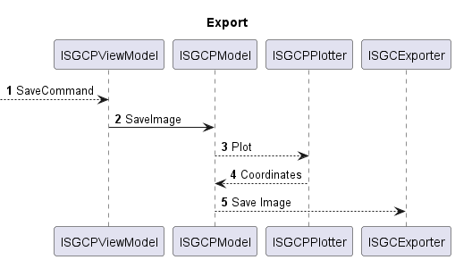

# Request
[Software Plotter](Task_Software_Plotter.pdf)

---

# Requirements

The user wants to modify the parameters of the trigonometric functions sin, cos and sinc.
The functions and its parameters are displayed in the following form:
- sin(x): a * sin(b * (x - c)) + d 
- cos(x): a * cos(b * (x - c)) + d
- sinc(x) = si(pi * x) = sin(pi * x) / x

- **_TODO_**: arbitrary parameters?

The user can select one of them from 3 radio buttons and is shown a 2d visualization of the unmodified function.
It is drawn in as simple black line. As default (first start) the sin function is selected. 
- **_TODO_**: combobox with entries (sin, cos, sinc)

Each parameter value is displayed in a text box below the function and can be modified.

When the user modifies the parameters a second visualization is shown in the same coordinate system, reflecting the changes that the parameters introduced.
It is drawn as a simple red line.
- **_TODO_**: color / style of default function and modified function

The visualizations are plotted in a 2d coordinate system below the functions and parameters. The ranges for the x- and y-axis can be adjusted by the user
using 4 text boxes places at the respective corners of the coordinate system.

When the application is closed the last parameters should be saved to the user settings and are reused with the next application start.
- **_TODO_**: default / start values

The user has the possibility to save the plotted functions in a svg format by clicking a button ("Save Image") on the bottom right.
A save file dialog will open with the default file name of the function ("sin.svg", "cos.svg", "sinc.svg"). On confirming the save file dialog
the image is saved.
- **_TODO_**: which format? (svg, eps, pdf etc.)

MockUp:

# Tasks

- Discuss open points (TODOs) with stakeholder
  - There are still open points that have to be clarified marked with **_TODO_**
  

- Create view and view model
  - Using the mock-up the view should be created with all functions needed
  - The corresponding view model should be created

- Create model
  - The model used by the view should be created

- Create plotter
  - The model uses a plotter class that generates the data points
  - The plotter is configured with the settings that the user selected (function, parameters, axis)
  

- Create render interface
  - The data points provided by the plotter should be rendered by a component and provided to the view to display it.
  - Look into [Skia](https://github.com/mono/SkiaSharp)

- Save to file function
  - Add the save function to the view and viewmodel
  - Create an exporter for the data created by the plotter to svg

- Save last parameters
  - Save the last used function and parameters to the user settings on exit
  - Load the last saved function and parameters from the user settings on startup

# Additional Aspects
To conclude the requirement analysis I would add the following in discussion with the development team:
  - A rough time estimation 
  - A risk / difficulty assessment

# Software Concept

## Classes
The application is controlled from the SGCPModel.
The model controls the 3 partial aspects plotting, rendering and exporting and is triggered ba the view model.
For each aspect a component is injected that can be called to execute this aspect.

The plotter is called with the parameters given by the user and returns the calculated coordinates as an array ob x and y values.

The renderer is called with the calculated coordinates and returns the rendered image.

## Sequences
### Render
Rendering a new image is triggered by the view model by a parameter, function or axis change.
The model then starts the plotting of new coordinates by calling the plotter component.
After the coordinates are calculates the model passes these to the renderer.
The renderer returns an image that is provided to the view.

### Export
Exporting a new image is triggered by the view model by the save command.
The model is then called to save the image. This is done by calculating the coordinates with the plotter and the parameters.
After the coordinates are calculates the model passes these to the exporter to save the image.
